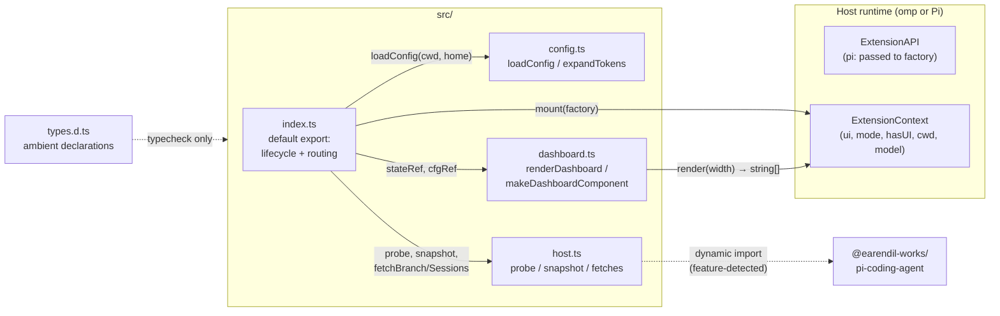
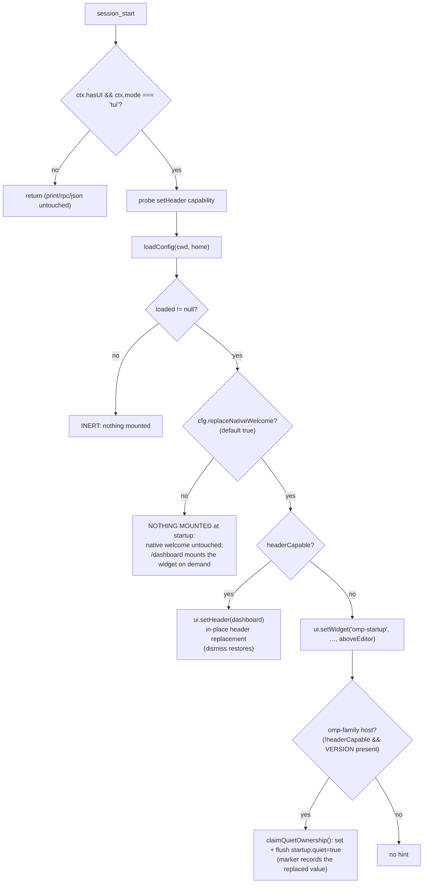
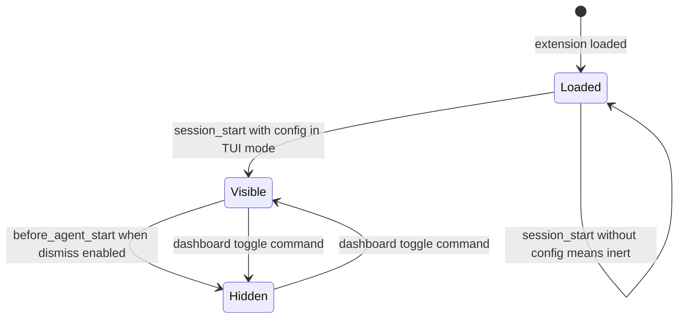
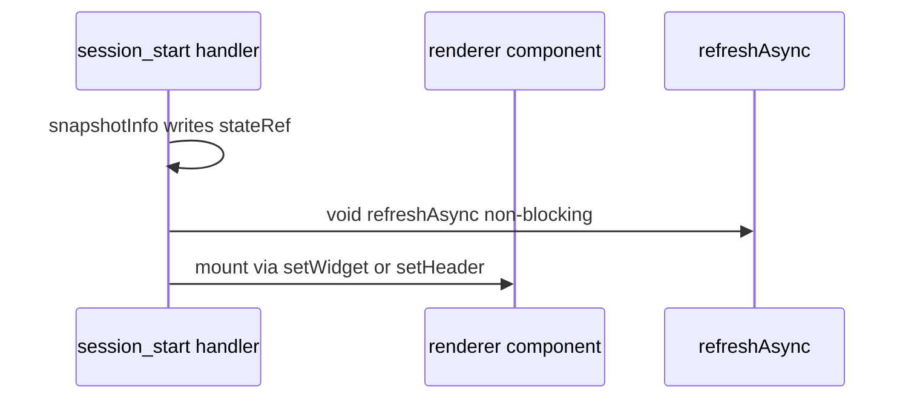
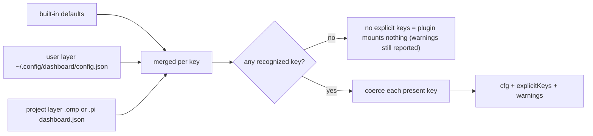

# omp-startup — Architecture

Technical reference for the codebase in this repository. Every behavioral claim
here is enforced by the test suite (`npm test`, 102 assertions across 4 suites)
or by the live host verifications summarized at the end.

## 1. What this is

`omp-startup` is a single-codebase extension that renders a customizable
startup dashboard in two coding-agent hosts:

| Host | Package | Extension manifest key |
|---|---|---|
| Oh My Pi (omp) | `@oh-my-pi/pi-coding-agent` (fork) | `omp.extensions` |
| upstream Pi | `@earendil-works/pi-coding-agent` | `pi.extensions` |

The dual manifest in `package.json` means one copy of the sources serves both
hosts. Both load TypeScript directly; there is **no build step and no runtime
dependency** (`typescript`/`@types/node` are dev-only).

Core product contract, enforced in code and tests:

1. **Inert until configured** — with no `dashboard.json` anywhere, no host UI
   surface is touched.
2. **Unconfigured elements keep native defaults** — `DEFAULT_CONFIG` mirrors
   the native omp `WelcomeComponent`; only explicitly configured keys change
   the render.
3. **The plugin writes no harness settings** — except the welcome takeover on
   omp: with `replaceNativeWelcome: true` (the default) it claims
   `startup.quiet` via the host SDK and keeps it `true` across launches so
   only the dashboard renders at startup. Ownership is recorded in a marker
   file; the previous value is restored (flushed at session start, never at
   exit) whenever a session starts without the takeover route. Setting
   `replaceNativeWelcome: false` makes every other code path read-only.

## 2. Module map



- `src/index.ts` — default-exported factory `(api: OmpStartupExtensionAPI) => void`.
  Registers `/dashboard`, subscribes to `session_start` and
  `before_agent_start`, owns mount state plus the quiet-ownership claim/give-up
  flow.
- `src/config.ts` — layered JSON loader with explicit-key tracking (drives the
  inert rule), per-key coercion with warnings, token expansion.
- `src/host.ts` — everything host-shaped: capability probe, info snapshot,
  git branch fetch, recent-sessions fetch (dynamic import of the host package),
  `loadHostSettings()` (feature-detected settings singleton with flush
  passthrough + test seam), quiet-ownership marker helpers.
- `src/dashboard.ts` — pure renderer: ANSI-aware width math, gradient painter,
  block builders, box/plain assembly, component factory.
- `types.d.ts` — ambient declarations for the used API subset; consumed only
  by `tsc --noEmit`, never at runtime.
- `tests/*.test.ts` — Node built-in runner (`node --test`), which executes
  TypeScript via type stripping on Node ≥ 23.

There are **no static imports of either host package**. The single dynamic
import (`src/host.ts`) is feature-detected and failure-tolerant; on omp the
loader rewrites the specifier onto its bundled copy, so the same file resolves
on both hosts.

## 3. Capability probe (the heart of cross-host compatibility)

The two hosts expose different header capabilities:

| Host | `ctx.ui.setHeader` behavior |
|---|---|
| upstream Pi | wired to `setExtensionHeader`, which calls `factory(tui, theme)` synchronously and swaps the mounted header |
| omp | declared in types, implemented as `setHeader: () => {}` |

`probeHeaderSupport(ui)` exploits that difference without version sniffing:

```ts
const sentinel = (_tui, _theme) => {
    invoked = true;          // flag flips at FACTORY-CALL time
    return { render: () => [] };
};
try { ui.setHeader(sentinel); } catch { return false; }
if (!invoked) return false;
ui.setHeader(undefined);     // restore: Pi actually MOUNTED the sentinel
return true;
```

The trailing restore call matters: on a header-capable host the sentinel
displaced the built-in header, so probing must put it back or every
inert/additive session would silently lose the native header.

Setting the flag inside the factory call (not inside `render()`) matters:
Pi's `setExtensionHeader` invokes the factory but defers painting. The probe
is re-run on every `session_start` and every `/dashboard` show, because hosts
may emit `session_start` more than once against *different* UI contexts
(installed Pi 0.84.2 fires it once, before its built-in header exists — so the
probe correctly reports "no header capability" there and the plugin falls back
to the additive widget).

Routing decision:



## 4. Lifecycle and state machine

Per-session state lives in the factory closure: `headerCapable`, `mountMode`
(`"header" | "widget" | null`), `visible`. Ownership of `startup.quiet` lives
outside the process, in `~/.config/dashboard/.ownership.json`, so it survives
restarts (see below).



- `/dashboard` is always registered, even with no config file — invoking it is
  an explicit user action, and unconfigured invocation shows the
  native-equivalent defaults.
- If the config renames `command`, the alias is registered best-effort during
  `session_start`; the default `/dashboard` remains.
- Late data (git branch, recent sessions) mutates the shared state ref and
  calls `refresh()` → the component's captured `tui.requestRender()`.

### Async data flow



### Quiet ownership (omp, default via `replaceNativeWelcome`)

On omp-family hosts the widget route cannot reach the transcript stream, and
the host reads `startup.quiet` once at boot — before extensions load. Writing
settings at `session_start` therefore cannot affect the *current* frame; it
can only shape the next launch. The design embraces that:

- **Claim** (`claimQuietOwnership()`, fired after the widget mounts): if quiet
  is not already `true`, set it and await `flush()` immediately — every
  durable write happens while the session is fully alive. The marker file then
  records `{ previous: false, state: "owned" }`.
- **Steady state**: with quiet already true and the marker owned, launches do
  zero settings I/O; only the dashboard renders at startup.
- **Never claim what we did not replace**: quiet `true` without a marker is
  the user's own preference. The plugin rides along visually but writes no
  marker, so an uninstall can never strip their choice.
- **Give-up** (`giveUpQuietOwnership()`): whenever a session starts *without*
  the takeover route — takeover disabled, config deleted (inert rule), a
  Pi-style header host, or non-TUI mode — restore the recorded previous value
  and clear the marker. Restores flush at session start by construction;
  exit-time restores are gone because they raced host teardown and lost
  (verified live on omp 18.0.3: a plain `/exit` while mounted left
  `quiet: true` behind under the old latch design).
- **Escape hatch**: if quiet reads `false` while the marker says owned, the
  user overrode us. Rewrite the marker as `yielded`, stack beside the native
  welcome with the advisory hint, and never claim again until they delete the
  marker.
- Restoring an originally unset key leaves an explicit
  `startup.quiet: false` behind (the SDK has no unset API) — semantically
  identical to the default.
- `scripts/uninstall-reset.js` (npm `postuninstall`) performs the same
  restore when npm removes an owned install; omp's bun-based uninstaller may
  skip lifecycle scripts, so the manual reset stays documented in USAGE.md.

## 5. Configuration pipeline

Layers, later winning per key: built-in defaults ← user
`~/.config/dashboard/config.json` ← project `<cwd>/.omp/dashboard.json`
(falling back to `.pi/`). Only keys present in a file enter `explicitKeys`;
the inert rule is `explicitKeys.size === 0 → loadConfig returns null`.



Coercion rules worth knowing (all unit-tested):

| Key | Rule |
|---|---|
| `width` | clamped to [20, 500], rounded |
| `sessions` | clamped to [0, 12], rounded |
| `layout` | `"box" \| "plain"` else default |
| `logo` | `"pi" \| "none" \| string[]` else default |
| `left`/`right` | unknown block names dropped (warning); all-invalid → default list |
| `shortcuts` | `[key,label]` pairs or `{key,label}` objects; invalid entries dropped |
| `command` | must match `^[\w-]+$` |
| absent keys | keep defaults, never validated, never warn |

Token expansion (`expandTokens`) supports `{user} {cwd} {dir} {model}
{provider} {version} {branch} {app} {date} {time}`; unknown tokens pass
through unchanged. `{app}` uses a binary-name heuristic
(`basename(process.execPath)` ∈ {`omp`,`pi`}, else empty). `{version}` reads
`api.pi.VERSION ?? api.pi.version` — omp exports it, upstream Pi currently
does not (title degrades gracefully; see §7).

## 6. Renderer design

`renderDashboard(cfg, state, theme, termWidth)` is pure — no host imports,
theme applied through a 2-method duck type (`fg(color,text)`,
`bold(text)`). Block builders emit lines with inline style markers
(`"\x01color\x02text"` spans); `applyTheme()` resolves them against the real
theme last, keeping builders theme-free and snapshot-testable.

Geometry replicates the native omp welcome (`welcome.ts #renderLines`):
max width from config, left column preferred 26/min 12, right column min 20,
35% split heuristic, single-column fallback below the breakpoint, rounded
border with embedded title and column tee (`┬`). All box rows share one total
visible width (asserted per row in tests).

Placement semantics: **the list that references a block decides where it
renders.** A block named in both lists renders once, on the left. `plain`
layout stacks left-order blocks centered, then right blocks as headed groups,
with borders removed.

ANSI safety: `visibleWidth` strips SGR before counting; `fitToWidth`
preserves escape runs while truncating visible content (native algorithm);
gradient paints per-character truecolor SGR along a bottom-left → top-right
diagonal across 5 stops (hot pink → violet → periwinkle → cyan → mint),
single resting frame.

## 7. Known deviations from pixel-perfect native parity

Documented deliberately; none affect the inert rule.

1. The host's random tip line below the box and live-keybinding hint labels
   are not exposed to plugins; the `shortcuts` block mirrors their content
   statically.
2. LSP-server rows are unavailable through public APIs.
3. Gradient renders the resting frame only (no intro sweep).
4. On hosts exposing neither `{app}` nor `{version}` (upstream Pi today), the
   default title degenerates to a lone "v"; the renderer skips it entirely in
   that case.
5. Installed Pi 0.84.x emits `session_start` before its header exists, so the
   in-place header replacement cannot engage there — the probe fails and the
   widget route runs instead (still with quiet takeover on omp only). Verified
   empirically; newer builds where the header exists first flip the probe
   automatically.

## 8. Verification strategy

| Layer | Mechanism |
|---|---|
| Unit | `node --test tests/*.test.ts` — 136 assertions: inert rule, layers, coercion incl. explicit-empty arrays and degenerate values, tokens, geometry invariants, lone-ESC/wide-glyph truncation, emptied-column frames, delta rendering, probe classification, detached-HEAD fetch, ownership-marker round-trip incl. boolean write seam, lifecycle routing against omp-style and pi-style mocks, non-TUI guards, quiet claim/steady-state/escape-hatch/give-up incl. flush-failure, marker-loss rollback and no-settings honesty, unconfigured read-only toggles |
| Smoke | `scripts/smoke.ts` — 44 host-free assertions (inert rule, render delta, probe routing, tokens, snapshot info, quiet-ownership seam) |
| Types | `tsc --noEmit` strict, including `tests/` |
| Live | PTY-driven omp 18.0.3 sessions (configured frame, resume parity with/without plugin, opted-out manual show, leak-reproduction and post-leak bare-resume) |

Live results recorded for the shipped build:

- omp launch (sandboxed `$HOME`, only the repo symlink loaded): with no prior
  state the very first engaged launch can stack native welcome + dashboard
  (the claim lands after the host's boot-time read); every later launch
  renders only the dashboard above the editor, `startup.quiet` owned via the
  marker. Verified across consecutive sandboxed launches.
- omp `--continue` (with and without the plugin, identical sandbox):
  natively the "Welcome back!" box renders at top with the transcript below;
  with the plugin it renders exactly the same, plus the dashboard directly
  above the input line. omp's `session_start` carries no resume reason, so
  resumed sessions intentionally behave like fresh ones.
- opted-out (`replaceNativeWelcome: false`): native frame untouched, nothing
  mounted, settings read-only; `/dashboard` stacks with the advisory.
- Leak reproduction under the previous latch design (kept as regression
  rationale): `/exit` while still mounted lost the restore write → next
  launch showed no welcome at all; with the plugin removed the editor sat
  bare. The ownership model eliminates exit-time writes entirely.
- pi: dashboard replaces the native header where the probe passes; no
  omp-specific hint; dismissal and `/dashboard` identical.
