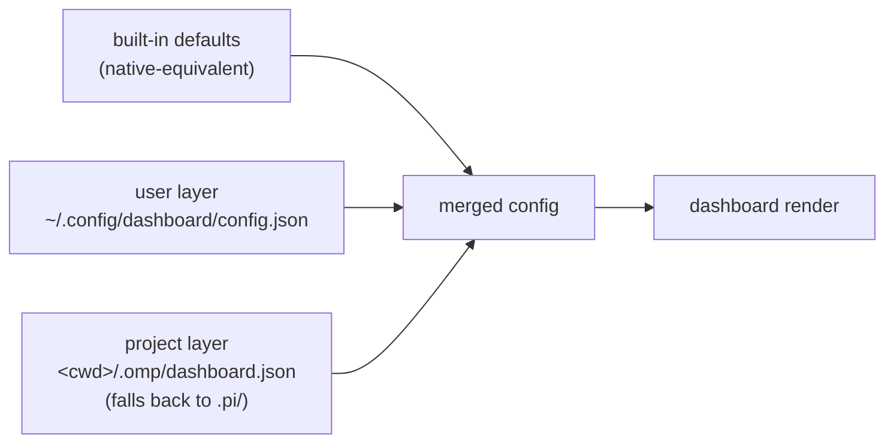
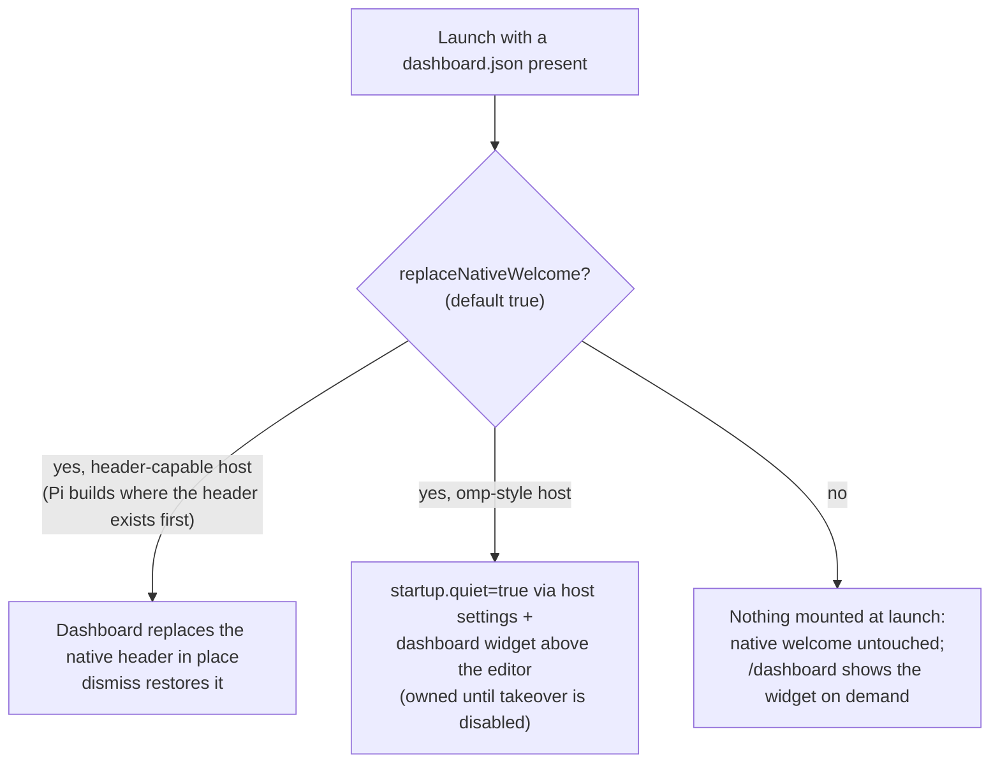

# Usage & Setup

Everything needed to install, configure, and operate `omp-startup` on either
host. Behavioral claims here are enforced by the test suite or verified live;
see [ARCHITECTURE.md](./ARCHITECTURE.md) for internals and the verification
log.

## Requirements

| | |
|---|---|
| omp | any current build (tested against 18.0.1) |
| Pi | 0.79+ recommended (tested against 0.84.2) |
| Terminal | truecolor recommended for `gradient` (any terminal works otherwise) |

No build step, no runtime dependencies, nothing to compile. The hosts load
the TypeScript sources directly.

## Install

### From npm (recommended)

Both hosts ship native installers that fetch from the npm registry and load
the package via its manifest:

```sh
omp plugin install omp-startup        # Oh My Pi → ~/.omp/plugins/node_modules
pi install npm:omp-startup            # Pi, user-level
pi install -l npm:omp-startup         # Pi, project-local → .pi/settings.json packages
```

- **omp requirement:** the native installer shells out to `bun install`; bun
  must be on `$PATH`. Without it, use the source-checkout symlink path below.
- **Update:** rerun the same command; add `--force` on omp to reinstall over
  an existing copy.
- **Remove:** `omp plugin uninstall omp-startup` / `pi remove omp-startup`.
- The plugin keeps one bookkeeping file on omp —
  `~/.config/dashboard/.ownership.json` — recording when it has taken over
  `startup.quiet`. If a session ever exits before the marker is cleaned up,
  remove it and set `startup.quiet: false` under the `startup:` section of
  `~/.omp/agent/config.yml` to bring the native welcome back. npm-based
  uninstalls run `scripts/uninstall-reset.js`, which does this automatically
  whenever the plugin actually owned the value.
- A scoped mirror is also published to [GitHub
  Packages](https://github.com/zhulinchng/omp-startup/packages) as
  `@zhulinchng/omp-startup` on every release; installing from that registry
  needs an npm token with `read:packages`.

> **Pi note:** `pi install` records the package in
> `~/.pi/agent/settings.json` under `packages` and unpacks it to
> `~/.pi/agent/npm/node_modules/`; `pi list` shows what's registered.

### From a source checkout

Pick **one** location per host. A symlink works and tracks your checkout;
a plain copy works too.

```sh
# ── omp ──────────────────────────────────────────────────────────
ln -s /path/to/omp-startup ~/.omp/agent/extensions/omp-startup      # user-level
# …or per-project:
mkdir -p .omp/extensions && ln -s /path/to/omp-startup .omp/extensions/omp-startup

# ── Pi ───────────────────────────────────────────────────────────
ln -s /path/to/omp-startup ~/.pi/agent/extensions/omp-startup       # user-level
# …or per-project:
mkdir -p .pi/extensions && ln -s /path/to/omp-startup .pi/extensions/omp-startup
```

Both hosts also honor a package manifest — this repo ships one:

```jsonc
// package.json (excerpt)
{ "omp": { "extensions": ["./src/index.ts"] }, "pi": { "extensions": ["./src/index.ts"] } }
```

so pointing a host at the repository directory is enough; it discovers
`src/index.ts` itself.

> **Pi note:** Pi ≥ 0.79 asks once per directory whether to *trust
> project-local* inputs (`.pi/extensions`, `.pi/dashboard.json`). User-level
> installs under `~/.pi/agent/extensions` are always trusted.

**Uninstall:** delete the symlink. The plugin stores no state anywhere else.


## Configure

### Layers



Later layers win **per key**. If neither file exists — or they contain no
recognized key — the plugin does **nothing at all**: both hosts behave exactly
as without it.

### Minimal example

```json
{ "greeting": "Ahoy, {user}!" }
```

Save as `.omp/dashboard.json` (omp projects), `.pi/dashboard.json`
(Pi projects), or `~/.config/dashboard/config.json` (everywhere).

### Option reference

| Key | Type | Default | Meaning |
|---|---|---|---|
| `layout` | `"box" \| "plain"` | `"box"` | bordered two-column box (native look) or borderless stack |
| `title` | string | `"{app} v{version}"` | label embedded in the top border; `""` removes it |
| `width` | number 20–500 | `100` | maximum box width in columns |
| `logo` | `"pi" \| "none" \| string[]` | `"pi"` | native π art, nothing, or custom ASCII art lines |
| `gradient` | boolean | `true` | diagonal multi-stop truecolor gradient over the logo |
| `greeting` | string | `"Welcome back!"` | left-column headline |
| `left` | block[] | `["greeting","blank","logo","blank","info"]` | block order, left column (whole content when `plain`) |
| `right` | block[] | `["shortcuts","sessions"]` | block order, right column (`box` layout only) |
| `info` | string[] | `["{model}","{provider}"]` | token rows under the logo; rows expanding to `""` are skipped (use a `blank` block for deliberate gaps) |
| `shortcuts` | `[key,label][]` | native hints | pairs rendered under the “Tips” header |
| `sessions` | number 0–12 | `4` | recent-session rows; `0` hides the block |
| `quote` | string \| string[] | `[]` | stable pick rendered dim/italic below the box; rotates through the list daily; embedded newlines render as separate lines |
| `dismiss` | boolean | `true` | hide after the first submitted prompt |
| `command` | string | `"dashboard"` | slash-command name (letters/digits/`_`/`-`) |
| `replaceNativeWelcome` | boolean | `true` | take over the native welcome slot: Pi swaps its header component in place (the dashboard scrolls away like the native one); on omp the plugin takes ownership of `startup.quiet` across launches so only the dashboard renders at startup (previous value restored automatically if takeover is ever disabled) |

Blocks: `greeting` · `logo` · `blank` · `info` · `shortcuts` · `sessions`.
A block named in both columns renders once, on the left.

### Tokens

| Token | Value |
|---|---|
| `{user}` | `$USER` / `$USERNAME` / `?` |
| `{cwd}` / `{dir}` | working directory / its basename |
| `{model}` / `{provider}` | active session model |
| `{version}` | host version (hosts that export one; empty on current Pi builds) |
| `{branch}` | current git branch (fetched asynchronously via the host) |
| `{app}` | `omp` or `pi` when detectable from the running binary, else empty |
| `{date}` / `{time}` | local date `YYYY-MM-DD` / time `HH:MM` at render time |

Usable in `greeting`, `title`, `info`, and `quote`. Unknown tokens pass
through untouched.

## Daily use

- `/dashboard` — toggles the dashboard at any time, config or not. With no
  config it shows the native-equivalent defaults.
- On first submitted prompt the dashboard hides (`dismiss: true`). Run
  `/dashboard` to bring it back; edit `dismiss` to keep it pinned.

## How each host behaves



| Host | Route | Native welcome |
|---|---|---|
| omp | quiet takeover + widget above the editor | with the default `replaceNativeWelcome: true` the plugin takes ownership of `startup.quiet` across launches, so only the dashboard renders at startup; turning takeover off (or deleting the config) hands the previous value back at the next launch; with `false` nothing mounts at launch and the dashboard is manual-only |
| Pi (0.84.x) | header replacement in place | with the default, the dashboard replaces the native header component and scrolls away like it; engages on builds where the header already exists at `session_start`; `false` leaves the native chrome untouched |

`replaceNativeWelcome` notes (omp):

- The host reads `startup.quiet` once at boot, before extensions load — so no
  extension can suppress the native welcome for the *current* session by
  writing settings. Instead the plugin claims ownership: while takeover is
  configured, quiet stays `true` between launches and only your dashboard
  renders at startup.
- The write goes to the user-global omp settings file, so a concurrently
  running omp in another project sees quiet mode too.
- Ownership is recorded in `~/.config/dashboard/.ownership.json`. When a
  session starts without the takeover route (takeover set to `false`, config
  deleted entirely, or a Pi-style header host), the previous value is
  restored with an immediately flushed write at session start — never at
  exit, where restore writes used to race process teardown and get lost.
- Escape hatch: set `startup.quiet: false` yourself in
  `~/.omp/agent/config.yml`. At its next launch the plugin detects the
  override, yields permanently (native welcome back; `/dashboard` shows the
  widget stacked beside it with an advisory), and never touches the key again
  until you delete the marker file.
- When the previous value was unset, giving ownership back leaves an explicit
  `startup.quiet: false` behind — semantically identical to the default.

Manual `/dashboard` shows stack beside the native welcome with a one-line
hint pointing at the setting. The hint appears whenever stacking is
permanent — takeover disabled, an unconfigured project (the inert contract
forbids settings writes even for explicit toggles), a host without settings,
or the escape hatch above — and disappears together with the dashboard.
Settings writes happen only when a configured project actually claims
ownership; failed or unavailable claims never record ownership and never
write.

The plugin writes harness settings in exactly one case: on omp with
`replaceNativeWelcome: true` (the default), it claims the single
`startup.quiet` value described above and restores it when takeover stops.
Setting it `false` makes every code path read-only.

### Honest deviations from the native look

1. No random “Tip:” line below the box (the pool lives inside the host).
2. Shortcut labels are static text; the native ones reflect your live
   keybindings.
3. LSP-server rows aren’t reachable through public APIs.
4. Gradient is a single resting frame — no intro animation.

## Troubleshooting

| Symptom | Cause & fix |
|---|---|
| Nothing changes after adding a config file | File must be named exactly `dashboard.json` in `.omp/` (or `.pi/`) of the project, or `~/.config/dashboard/config.json`; JSON must parse; at least one recognized key must be present |
| Two welcome boxes on omp after `/dashboard` | You run with `"replaceNativeWelcome": false`, so the widget stacks beside the native welcome and hints at the setting; set it back to `true` (default) for the takeover |
| Warning names `hideNativeWelcome` or `replaceHeader` | Those keys were replaced by `replaceNativeWelcome`; delete the old key from your `dashboard.json` |
| Dashboard missing on Pi | Pi may have asked whether to trust the project directory — answer once; or move the extension to `~/.pi/agent/extensions` |
| Sessions list empty | The sessions fetch degrades silently when the host API is unavailable; recent sessions appear once the host exposes them |
| Wrong colors in the logo | Terminal lacks truecolor; set `"gradient": false` |
| Native welcome missing on omp after uninstalling | A takeover latched `startup.quiet: true`; set it to `false` under the `startup:` section of `~/.omp/agent/config.yml` (npm-based uninstalls run the reset automatically whenever the plugin owned the value) |
| Want the native welcome back while keeping the plugin | Set `startup.quiet: false` in `~/.omp/agent/config.yml`; the plugin yields at its next launch and stops managing the key (delete `~/.config/dashboard/.ownership.json` to let it take over again) |

Invalid values never break the session: the loader falls back to the default
for that key and surfaces one warning naming the offending file. An explicitly
configured empty array (`"left": []`, `"shortcuts": []`) is valid, not
invalid — it renders no blocks/hints instead of reverting to the defaults.

```sh
npm install        # dev-only tooling (typescript, @types/node)
npm run typecheck  # strict tsc over src/, scripts/, tests/
npm run smoke      # inert/render-delta/probe/token/seam assertions (53 checks)
npm test           # 178-assertion suite (node:test, zero extra deps)
```
