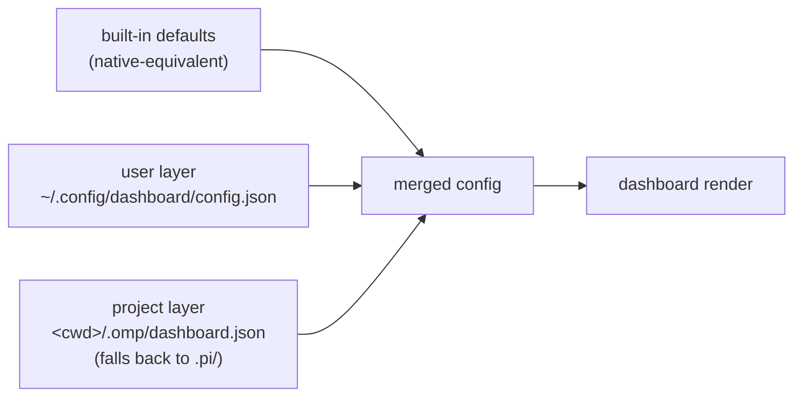
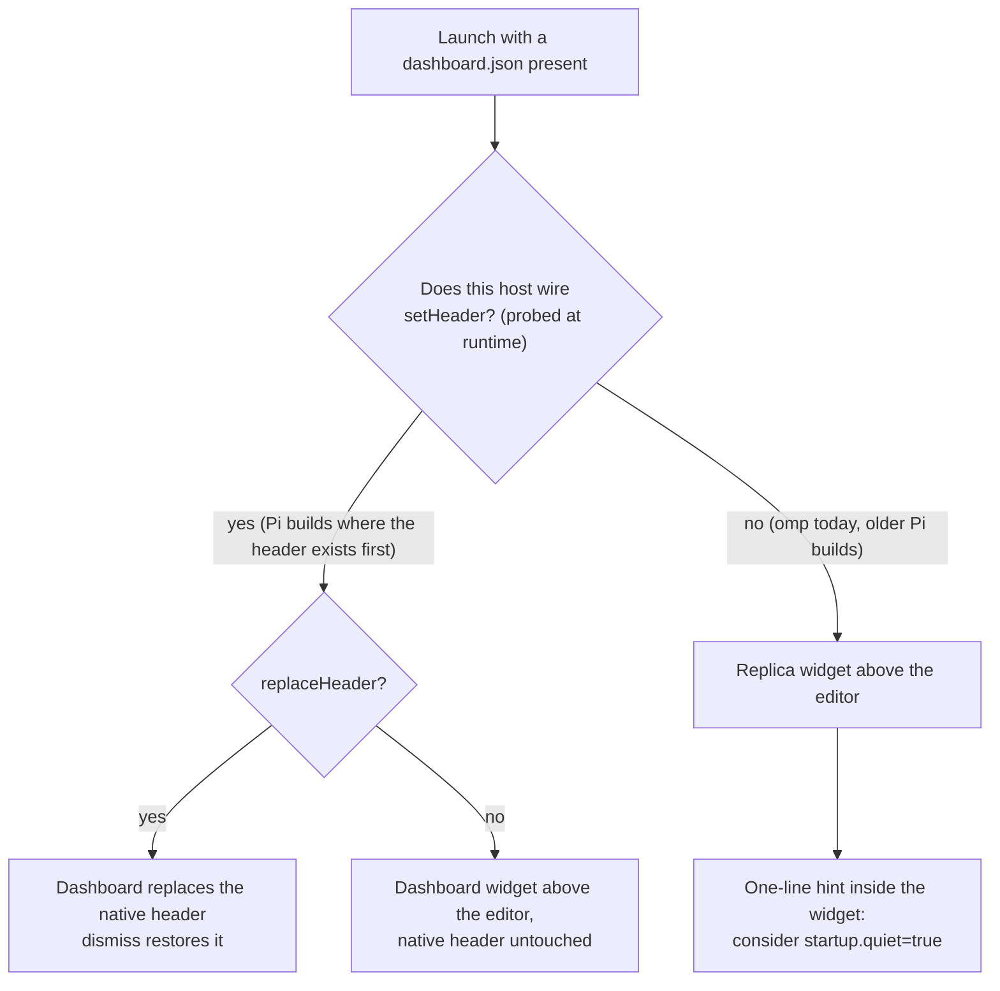

# Usage & Setup

Everything needed to install, configure, and operate `omp-startup` on either
host. Behavioral claims here are enforced by the test suite or verified live;
see [ARCHITECTURE.md](./ARCHITECTURE.md) for internals and the verification
log.

## Requirements

| | |
|---|---|
| omp | any current build (tested against 18.0.1) |
| Pi | 0.79+ recommended (tested against 0.84.2) |
| Terminal | truecolor recommended for `gradient` (any terminal works otherwise) |

No build step, no runtime dependencies, nothing to compile. The hosts load
the TypeScript sources directly.

## Install

### From npm (recommended)

Both hosts ship native installers that fetch from the npm registry and load
the package via its manifest:

```sh
omp plugin install omp-startup        # Oh My Pi → ~/.omp/agent/plugins
pi install npm:omp-startup            # Pi, user-level → settings.json extensions
pi install -l npm:omp-startup         # Pi, project-local → .pi/settings.json
```

- **Update:** rerun the same command (fetches the latest published version).
  omp: `omp plugin uninstall omp-startup` first if versions are cached.

- **Remove:** `omp plugin uninstall omp-startup` / `pi remove omp-startup`.
- The plugin stores no state; removal restores the previous welcome exactly.

> **Pi note:** `pi install` records the package in
> `settings.json#extensions`; `pi list` shows what's registered.

### From a source checkout

Pick **one** location per host. A symlink works and tracks your checkout;
a plain copy works too.

```sh
# ── omp ──────────────────────────────────────────────────────────
ln -s /path/to/omp-startup ~/.omp/agent/extensions/omp-startup      # user-level
# …or per-project:
mkdir -p .omp/extensions && ln -s /path/to/omp-startup .omp/extensions/omp-startup

# ── Pi ───────────────────────────────────────────────────────────
ln -s /path/to/omp-startup ~/.pi/agent/extensions/omp-startup       # user-level
# …or per-project:
mkdir -p .pi/extensions && ln -s /path/to/omp-startup .pi/extensions/omp-startup
```

Both hosts also honor a package manifest — this repo ships one:

```jsonc
// package.json (excerpt)
{ "omp": { "extensions": ["./src/index.ts"] }, "pi": { "extensions": ["./src/index.ts"] } }
```

so pointing a host at the repository directory is enough; it discovers
`src/index.ts` itself.

> **Pi note:** Pi ≥ 0.79 asks once per directory whether to *trust
> project-local* inputs (`.pi/extensions`, `.pi/dashboard.json`). User-level
> installs under `~/.pi/agent/extensions` are always trusted.

**Uninstall:** delete the symlink. The plugin stores no state anywhere else.


## Configure

### Layers



Later layers win **per key**. If neither file exists — or they contain no
recognized key — the plugin does **nothing at all**: both hosts behave exactly
as without it.

### Minimal example

```json
{ "greeting": "Ahoy, {user}!" }
```

Save as `.omp/dashboard.json` (omp projects), `.pi/dashboard.json`
(Pi projects), or `~/.config/dashboard/config.json` (everywhere).

### Option reference

| Key | Type | Default | Meaning |
|---|---|---|---|
| `layout` | `"box" \| "plain"` | `"box"` | bordered two-column box (native look) or borderless stack |
| `title` | string | `"{app} v{version}"` | label embedded in the top border; `""` removes it |
| `width` | number 20–500 | `100` | maximum box width in columns |
| `logo` | `"pi" \| "none" \| string[]` | `"pi"` | native π art, nothing, or custom ASCII art lines |
| `gradient` | boolean | `true` | diagonal multi-stop truecolor gradient over the logo |
| `greeting` | string | `"Welcome back!"` | left-column headline |
| `left` | block[] | `["greeting","blank","logo","blank","info"]` | block order, left column (whole content when `plain`) |
| `right` | block[] | `["shortcuts","sessions"]` | block order, right column (`box` layout only) |
| `info` | string[] | `["{model}","{provider}"]` | token rows under the logo; `""` renders blank |
| `shortcuts` | `[key,label][]` | native hints | pairs rendered under the “Tips” header |
| `sessions` | number 0–12 | `4` | recent-session rows; `0` hides the block |
| `quote` | string \| string[] | `[]` | random pick rendered dim/italic below the box |
| `dismiss` | boolean | `true` | hide after the first submitted prompt |
| `command` | string | `"dashboard"` | slash-command name (letters/digits/`_`/`-`) |
| `replaceHeader` | boolean | `false` | **Pi only**: replace the whole native header instead of adding a widget |

Blocks: `greeting` · `logo` · `blank` · `info` · `shortcuts` · `sessions`.
A block named in both columns renders once, on the left.

### Tokens

| Token | Value |
|---|---|
| `{user}` | `$USER` / `$USERNAME` / `?` |
| `{cwd}` / `{dir}` | working directory / its basename |
| `{model}` / `{provider}` | active session model |
| `{version}` | host version (hosts that export one; empty on current Pi builds) |
| `{branch}` | current git branch (fetched asynchronously via the host) |
| `{app}` | `omp` or `pi` when detectable from the running binary, else empty |
| `{date}` / `{time}` | local date `YYYY-MM-DD` / time `HH:MM` at render time |

Usable in `greeting`, `title`, `info`, and `quote`. Unknown tokens pass
through untouched.

## Daily use

- `/dashboard` — toggles the dashboard at any time, config or not. With no
  config it shows the native-equivalent defaults.
- On first submitted prompt the dashboard hides (`dismiss: true`). Run
  `/dashboard` to bring it back; edit `dismiss` to keep it pinned.

## How each host behaves



| Host | Route | Native welcome |
|---|---|---|
| omp | replica widget above the editor | still renders unless you set `startup.quiet: true`; while stacked, the widget shows a one-line hint pointing at that setting |
| Pi (0.84.x) | additive widget above the editor | native chrome untouched; `replaceHeader: true` engages on builds where the header already exists at `session_start` |

The plugin never edits settings itself. The hint is informational only and
disappears together with the dashboard.

### Honest deviations from the native look

1. No random “Tip:” line below the box (the pool lives inside the host).
2. Shortcut labels are static text; the native ones reflect your live
   keybindings.
3. LSP-server rows aren’t reachable through public APIs.
4. Gradient is a single resting frame — no intro animation.

## Troubleshooting

| Symptom | Cause & fix |
|---|---|
| Nothing changes after adding a config file | File must be named exactly `dashboard.json` in `.omp/` (or `.pi/`) of the project, or `~/.config/dashboard/config.json`; JSON must parse; at least one recognized key must be present |
| Two welcome boxes show on omp | Expected while stacked: set `"startup.quiet": true` in omp settings if you prefer only the dashboard |
| Dashboard missing on Pi | Pi may have asked whether to trust the project directory — answer once; or move the extension to `~/.pi/agent/extensions` |
| Sessions list empty | The sessions fetch degrades silently when the host API is unavailable; recent sessions appear once the host exposes them |
| Wrong colors in the logo | Terminal lacks truecolor; set `"gradient": false` |

Invalid values never break the session: the loader falls back to the default
for that key and surfaces one warning naming the offending file.

## Verify your setup

```sh
npm install        # dev-only tooling (typescript, @types/node)
npm run typecheck  # strict tsc over src/, scripts/, tests/
npm run smoke      # inert/render-delta/probe/token assertions (35 checks)
npm test           # 85-assertion suite (node:test, zero extra deps)
```
